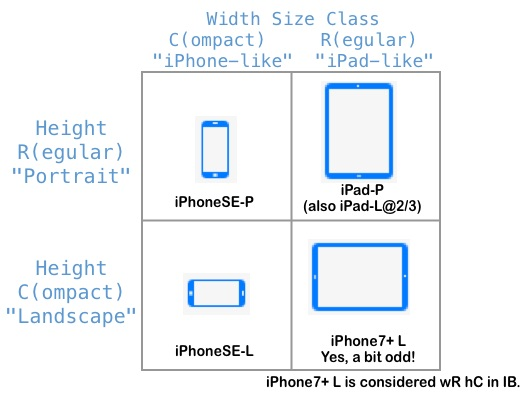

#  CustomSizeTrait

This VC overrides some of the Size Trait Collections to allow for easy
customization of the UI based on AutoLayout in a StoryBoard. By using
this class, you can easily design you UI in a StoryBoard with differences for
orientation (height size class) and/or device size iPhone/iPad (width size class).
The table below shows the IB Storyboard "View as" options to use.

## On YouTube

A complete video explanation and demo of this code is available on YouTube: https://youtu.be/0Y_d_UdFiDI
